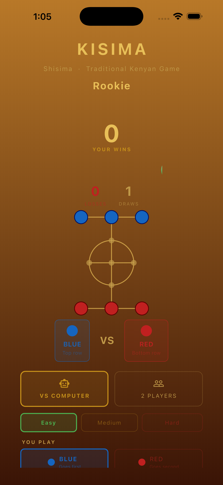

# Kisima

A mobile implementation of **Shisima** — a traditional two-player strategy board game from the Kenyan coast.

## Screenshots

<p align="center">
  
  &nbsp;&nbsp;&nbsp;&nbsp;
  
</p>
<p align="center">
  <em>Home Screen &nbsp;&nbsp;&nbsp;&nbsp;&nbsp;&nbsp;&nbsp;&nbsp;&nbsp;&nbsp;&nbsp;&nbsp;&nbsp;&nbsp;&nbsp;&nbsp;&nbsp;&nbsp;&nbsp;&nbsp;&nbsp;&nbsp;&nbsp;&nbsp; Game Screen</em>
</p>

## About

Kisima is a faithful digital adaptation of Shisima, played on an 11-node board. Players move their three pieces through a central circle toward the opponent's home row. The game rewards positional thinking and board control.

## Features

- **VS Computer** — AI opponent with Easy, Medium, and Hard difficulty levels
- **2 Players** — local pass-and-play mode
- **Smart AI** — minimax-based engine; Hard mode plays near-optimally
- **Hints & Undo** — request a move suggestion or undo the last round (VS Computer)
- **Save & Resume** — mid-game state is saved automatically when you leave
- **30-minute timer** — game ends in a draw if neither player wins in time
- **Danger warnings** — haptic feedback when you are one move from being trapped
- **Win/loss/draw stats** — lifetime record tracked on the home screen

## How to Play

1. **Goal** — move all 3 of your pieces into the opponent's home row.
   - Blue wins by occupying the bottom row (Red's home).
   - Red wins by occupying the top row (Blue's home).
2. **Moves** — tap a piece, then tap a connected node to slide it one step. You cannot jump over other pieces.
3. **Blocked = lose** — if all your pieces are surrounded with no valid move, you lose the round immediately.
4. **Central hub** — the circle and its center connect in all directions. Controlling this area is key.

## Tech Stack

- **Flutter** (Dart) — cross-platform mobile
- **audioplayers** — sound effects
- **shared_preferences** — local stats and game save
- **Custom painters** — board and piece rendering via `CustomPaint`

## Getting Started

```bash
flutter pub get
flutter run
```

Requires Flutter 3.x and Dart 3.x.
